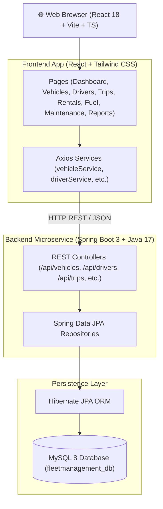

# 🚛 Fleet Manager - Enterprise Fleet Management System

[](https://spring.io/projects/spring-boot)
[](https://react.dev/)
[](https://www.typescriptlang.org/)
[](https://vitejs.dev/)
[](https://tailwindcss.com/)
[](https://www.mysql.com/)
[-008000?style=for-the-badge)](https://en.wikipedia.org/wiki/Indian_rupee)

An enterprise-grade **Fleet Management & Operations Control System** engineered with a **Spring Boot 3** REST API backend and a **React 18 + Vite + TypeScript** single-page application frontend.

The application operates with **zero preloaded demo data**, connecting directly to **MySQL 8** (`fleetmanagement_db`) as the single source of truth. All financial calculations and reporting metrics adhere strictly to **Indian Rupees (₹ / INR)**.

---

## 📑 Table of Contents

- [Key Features](#-key-features)
- [System Architecture](#-system-architecture)
- [Technology Stack](#-technology-stack)
- [Project Directory Structure](#-project-directory-structure)
- [MySQL 8 Database Setup](#-mysql-8-database-setup)
- [Local Installation & Setup](#-local-installation--setup)
- [Running Backend & Frontend](#-running-backend--frontend)
- [REST API Endpoints](#-rest-api-endpoints)
- [Documentation Index](#-documentation-index)
- [License & Author](#-license--author)

---

## ⚡ Key Features

- **📊 Command Center Dashboard**: Real-time operational metrics tracking active vehicles, assigned drivers, ongoing dispatches, fuel expenses, maintenance costs, and total revenue in **Indian Rupees (₹)**.
- **🚚 Vehicle Fleet Management**: Complete registry tracking VIN, license plates, fuel type, mileage (KM), tank capacity, current fuel level, and status (`AVAILABLE`, `IN_TRANSIT`, `IN_MAINTENANCE`, `OUT_OF_SERVICE`).
- **👨‍✈️ Driver Roster & Safety Index**: CDL commercial driver management with license category, expiry warning alerts, assigned vehicles, and safety score indices.
- **🛣️ Route Dispatch & Trip Tracking**: Route planning from origin to destination, scheduled vs actual timestamps, distance (KM), and automated driver trip counters.
- **🤝 Customer Rentals & Agreements**: Corporate client accounts, vehicle lease contracts, daily rental rates in **INR (₹)**, security deposits, and contract dates.
- **⛽ Fuel Expenditure Tracking**: Refill logs capturing volume in liters, price per liter in **INR (₹)**, station name, and automatic vehicle odometer updates via MySQL triggers.
- **🔧 Preventive Maintenance & Repairs**: Service work orders, repair priorities (`LOW`, `MEDIUM`, `HIGH`, `CRITICAL`), service centers, and estimated/actual repair costs in **INR (₹)**.
- **🔔 Notifications & Audit Logs**: System warnings for license expirations and maintenance due dates, paired with 256-bit TLS encrypted session authentication.

---

## 🏗 System Architecture



For complete architecture details, see [docs/architecture/system_architecture.md](docs/architecture/system_architecture.md).

---

## 🛠 Technology Stack

| Layer | Technology | Version | Purpose |
| :--- | :--- | :--- | :--- |
| **Frontend Core** | React | `18.3.1` | UI Component Rendering Engine |
| **Build Tool** | Vite | `5.4.21` | Dev Server & Production Bundler |
| **Language** | TypeScript | `5.5.3` | Type-Safe Client Codebase |
| **Styling** | Tailwind CSS | `3.4.17` | Utility-First Responsive Design System |
| **Icons** | Lucide React | `0.475.0` | SVG Icon Suite |
| **Charts** | Chart.js | `4.4.8` | Data Visualization & Analytics |
| **HTTP** | Axios | `1.7.9` | Asynchronous REST Client |
| **Backend Core** | Spring Boot | `3.4.1` | Java Enterprise Microservice Framework |
| **JDK** | Java | `17` | Server Runtime Environment |
| **ORM** | Hibernate JPA | `6.x` | Database Mapping Layer |
| **Database** | MySQL | `8.0+` | Relational 3NF Database |
| **Currency** | Indian Rupee | **INR (₹)** | System Monetary Standard |

---

## 📁 Project Directory Structure

```
Fleetmanagement/
├── database/                          # MySQL 8 DDL & Import Scripts
│   ├── schema.sql                     # Table Definitions (3NF, Audit Columns)
│   ├── indexes.sql                    # Performance B-Tree Indexes
│   ├── constraints.sql                # Range & CHECK Constraints
│   ├── foreign_keys.sql               # Foreign Key Constraints
│   ├── views.sql                      # Reporting Views (INR Standard)
│   ├── triggers.sql                   # Odometer & Trip Sync Triggers
│   └── fleetmanagement_mysql8.sql     # Master MySQL Workbench Import Script
├── docs/                              # Project Documentation Suite
│   ├── architecture/                  # Architecture & Tech Stack Specs
│   ├── diagrams/                      # UML Class, ERD, Sequence & Flowcharts
│   ├── api/                           # REST API Specification
│   ├── database/                      # Data Dictionary Specifications
│   └── screenshots/                   # Module UI Screenshots Guide
├── frontend/                          # React 18 + Vite TypeScript App
│   ├── src/
│   │   ├── components/                # Reusable UI Components
│   │   ├── context/                   # Context Providers
│   │   ├── hooks/                     # Custom React Hooks
│   │   ├── pages/                     # Application Page Modules
│   │   ├── services/                  # Axios REST API Services
│   │   └── utils/                     # Formatters (INR ₹) & Validators
│   ├── package.json
│   └── vite.config.ts
├── src/                               # Spring Boot 3 Java Application
│   ├── main/
│   │   ├── java/com/fleetmanagement/
│   │   │   ├── controller/            # REST API Controllers
│   │   │   ├── entity/                # JPA Domain Entities
│   │   │   └── repository/            # Spring Data JPA Repositories
│   │   └── resources/
│   │       └── application.properties # MySQL 8 Database Configuration
└── pom.xml                            # Maven Dependency Management
```

---

## 🗄 MySQL 8 Database Setup

1. Open **MySQL Workbench** or MySQL CLI.
2. Open and execute the master import script:
   ```bash
   database/fleetmanagement_mysql8.sql
   ```
3. This creates database `fleetmanagement_db` containing 21 normalized 3NF tables with zero sample data.

---

## 🚀 Local Installation & Running Guide

### 1. Prerequisites
- **JDK 17** installed and added to `PATH`.
- **Node.js v18+** and `npm` installed.
- **MySQL 8 Server** running on `localhost:3306`.

### 2. Configure Database Credentials
Edit `src/main/resources/application.properties`:
```properties
spring.datasource.url=jdbc:mysql://localhost:3306/fleetmanagement_db?useSSL=false&serverTimezone=UTC&allowPublicKeyRetrieval=true
spring.datasource.username=root
spring.datasource.password=root
```

### 3. Run Backend Microservice
```bash
# Compile and start Spring Boot server on port 8080
./mvnw spring-boot:run
```

### 4. Run Frontend Application
```bash
cd frontend
npm install
npm run dev
```
Open `http://localhost:5173` in your browser.

---

## 🔑 Login Credentials

| Field | Value |
| :--- | :--- |
| **Email Address** | `admin@fleetmaster.com` |
| **Password** | `password123` |

---

## 📚 Complete Documentation Index

- 📐 [System Architecture & Package Specs](docs/architecture/system_architecture.md)
- 📊 [UML Class Diagram Specs](docs/diagrams/uml_class_diagram.md)
- 🗃 [Entity Relationship (ER) Diagram Specs](docs/diagrams/er_diagram.md)
- 🔄 [Sequence Diagrams Specification](docs/diagrams/sequence_diagrams.md)
- 🔀 [Operational Process Flowcharts](docs/diagrams/flowcharts.md)
- 🌐 [REST API Endpoint Documentation](docs/api/rest_api_documentation.md)
- 🗂 [MySQL Data Dictionary Specifications](docs/database/database_documentation.md)
- 🖼 [Screenshots Gallery Guide](docs/screenshots/README.md)

---

## 📜 License & Credits

Designed and developed as an enterprise open-source reference for Advanced Fleet Management Systems.