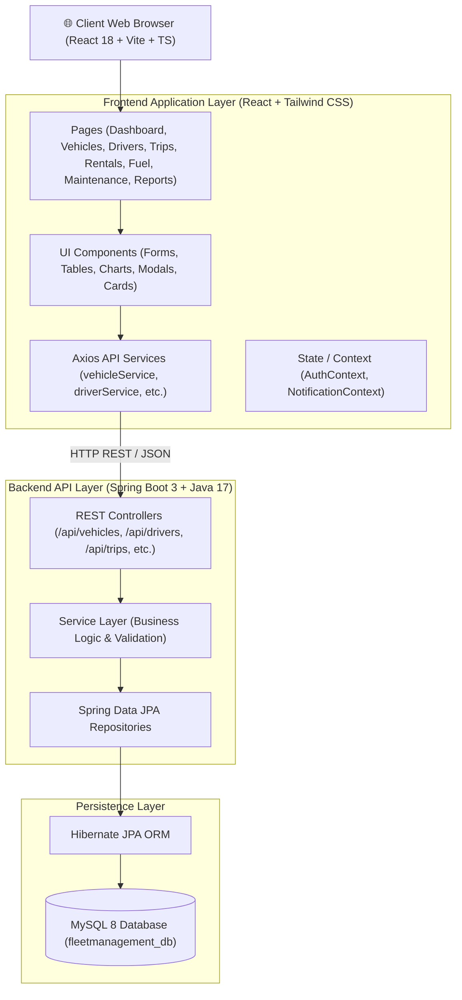
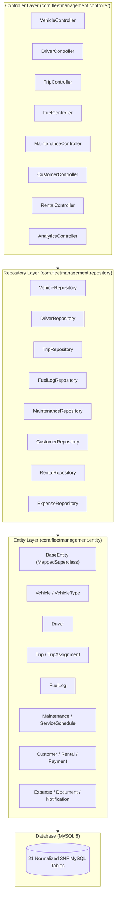

# System Architecture & Package Structure

This document outlines the high-level architecture, package design, technology stack, and project structure for the **Fleet Manager** system.

---

## 1. High-Level System Architecture



---

## 2. Package Layered Architecture



---

## 3. Technology Stack Matrix

| Layer | Technology | Version | Purpose / Function |
| :--- | :--- | :--- | :--- |
| **Frontend Core** | React | `18.3.1` | User Interface Component Rendering |
| **Build Tooling** | Vite | `5.4.21` | Next-gen Frontend Bundling & Dev Server |
| **Language** | TypeScript | `5.5.3` | Type-safe Client Development |
| **Styling & CSS** | Tailwind CSS | `3.4.17` | Utility-first Design System |
| **Icons** | Lucide React | `0.475.0` | Modern SVG Icon Library |
| **Charts** | Chart.js / React-Chartjs-2 | `4.4.8` | Data Visualization & Analytics |
| **HTTP Client** | Axios | `1.7.9` | REST API Asynchronous Calls |
| **Backend Core** | Spring Boot | `3.4.1` | REST Microservice Framework |
| **JDK** | Java | `17` | Server Runtime Engine |
| **Persistence** | Spring Data JPA / Hibernate | `6.x` | Object-Relational Mapping (ORM) |
| **Database** | MySQL | `8.0+` | Relational Database Management System |
| **Audit Standards** | 3NF DDL + UTF8MB4 | - | Database Normalization & Internationalization |
| **Currency** | Indian Rupee (₹ / INR) | - | Standard Monetary Unit |

---

## 4. Directory Tree Structure

```
Fleetmanagement/
├── database/                          # MySQL 8 DDL & Import Scripts
│   ├── schema.sql                     # Table Definitions (3NF, Audit Columns)
│   ├── indexes.sql                    # Performance Indexes
│   ├── constraints.sql                # Range & CHECK Constraints
│   ├── foreign_keys.sql               # Foreign Key Referential Constraints
│   ├── views.sql                      # SQL Reporting Views (INR Standard)
│   ├── triggers.sql                   # Mileage & Trip Triggers
│   └── fleetmanagement_mysql8.sql     # Master MySQL Workbench Import Script
├── docs/                              # Project Documentation Directory
│   ├── architecture/                  # Architecture & Tech Stack Docs
│   ├── diagrams/                      # UML, ERD, Sequence & Flowchart Diagrams
│   ├── api/                           # REST API Endpoint Documentation
│   ├── database/                      # Database Schema Data Dictionary
│   └── screenshots/                   # Module UI Screenshots Guide
├── frontend/                          # React 18 + Vite TypeScript App
│   ├── src/
│   │   ├── components/                # Reusable UI Components
│   │   ├── context/                   # Auth & Notification Context Providers
│   │   ├── hooks/                     # Custom React Hooks
│   │   ├── pages/                     # Application Page Modules
│   │   ├── routes/                    # React Router Navigation Routes
│   │   ├── services/                  # Axios REST API Services
│   │   ├── types/                     # TypeScript Interfaces
│   │   └── utils/                     # Formatters & Validators
│   ├── index.html
│   ├── package.json
│   └── vite.config.ts
├── src/                               # Spring Boot 3 Java Application
│   ├── main/
│   │   ├── java/com/fleetmanagement/
│   │   │   ├── controller/            # REST API Controllers
│   │   │   ├── entity/                # JPA Domain Entities
│   │   │   ├── repository/            # Spring Data JPA Repositories
│   │   │   └── FleetmanagementApplication.java
│   │   └── resources/
│   │       └── application.properties # MySQL 8 Database Configuration
└── pom.xml                            # Maven Dependencies Configuration
```
