# Entity Relationship (ER) Diagram Specification

This document details the complete relational database schema for **MySQL 8** (`fleetmanagement_db`). All tables are in **Third Normal Form (3NF)** and utilize **Indian Rupees (₹ / INR)** for monetary values.

---

## Complete Database Entity Relationship Diagram

```mermaid
erDiagram
    roles ||--o{ role_permissions : "id -> role_id"
    permissions ||--o{ role_permissions : "id -> permission_id"
    users ||--o{ user_roles : "id -> user_id"
    roles ||--o{ user_roles : "id -> role_id"
    vehicle_types ||--o{ vehicles : "id -> vehicle_type_id"
    users ||--o| drivers : "id -> user_id"
    vehicles ||--o| drivers : "id -> assigned_vehicle_id"
    trips ||--o{ trip_assignments : "id -> trip_id"
    vehicles ||--o{ trip_assignments : "id -> vehicle_id"
    drivers ||--o{ trip_assignments : "id -> driver_id"
    customers ||--o{ rentals : "id -> customer_id"
    vehicles ||--o{ rentals : "id -> vehicle_id"
    rentals ||--o{ payments : "id -> rental_id"
    customers ||--o{ payments : "id -> customer_id"
    vehicles ||--o{ fuel_logs : "id -> vehicle_id"
    drivers ||--o{ fuel_logs : "id -> driver_id"
    vehicles ||--o{ maintenance : "id -> vehicle_id"
    vehicles ||--o{ service_schedule : "id -> vehicle_id"
    vehicles ||--o{ expenses : "id -> vehicle_id"
    trips ||--o{ expenses : "id -> trip_id"
    drivers ||--o{ expenses : "id -> driver_id"
    users ||--o{ notifications : "id -> recipient_user_id"
    users ||--o{ activity_logs : "id -> user_id"

    roles {
        bigint id PK
        varchar name UK
        varchar description
        datetime created_at
        datetime updated_at
        varchar created_by
        varchar updated_by
        tinyint is_deleted
    }

    permissions {
        bigint id PK
        varchar name UK
        varchar description
        datetime created_at
        datetime updated_at
        varchar created_by
        varchar updated_by
        tinyint is_deleted
    }

    role_permissions {
        bigint id PK
        bigint role_id FK
        bigint permission_id FK
    }

    users {
        bigint id PK
        varchar username UK
        varchar email UK
        varchar password_hash
        varchar full_name
        varchar phone
        varchar department
        varchar status
        varchar avatar_url
    }

    user_roles {
        bigint id PK
        bigint user_id FK
        bigint role_id FK
    }

    vehicle_types {
        bigint id PK
        varchar code UK
        varchar name
        varchar description
    }

    vehicles {
        bigint id PK
        varchar vin UK
        varchar plate_number UK
        varchar make
        varchar model
        int year
        bigint vehicle_type_id FK
        varchar fuel_type
        varchar status
        double mileage
        double fuel_capacity
        double current_fuel_level
        varchar location
    }

    drivers {
        bigint id PK
        bigint user_id FK
        varchar first_name
        varchar last_name
        varchar email UK
        varchar phone
        varchar license_number UK
        varchar license_category
        date license_expiry_date
        varchar status
        double safety_score
        int total_trips_completed
        bigint assigned_vehicle_id FK
        date joined_date
    }

    trips {
        bigint id PK
        varchar trip_code UK
        varchar origin
        varchar destination
        datetime scheduled_departure
        datetime scheduled_arrival
        datetime actual_departure
        datetime actual_arrival
        double distance_km
        varchar status
        text cargo_description
        text notes
    }

    trip_assignments {
        bigint id PK
        bigint trip_id FK
        bigint vehicle_id FK
        bigint driver_id FK
        datetime assigned_at
        varchar status
    }

    customers {
        bigint id PK
        varchar name
        varchar company_name
        varchar email UK
        varchar phone
        text address
        varchar gst_tax_id
        varchar status
        int total_bookings
        decimal total_spent_inr
    }

    rentals {
        bigint id PK
        varchar rental_code UK
        bigint customer_id FK
        bigint vehicle_id FK
        date start_date
        date end_date
        decimal daily_rate_inr
        decimal total_cost_inr
        decimal deposit_amount_inr
        varchar status
        text notes
    }

    payments {
        bigint id PK
        varchar payment_number UK
        bigint rental_id FK
        bigint customer_id FK
        decimal amount_inr
        datetime payment_date
        varchar payment_mode
        varchar transaction_reference
        varchar status
    }

    fuel_logs {
        bigint id PK
        bigint vehicle_id FK
        bigint driver_id FK
        double liters
        decimal cost_per_liter_inr
        decimal total_cost_inr
        double odometer_reading
        varchar station_name
        varchar fuel_card_number
        datetime filled_at
        text notes
    }

    maintenance {
        bigint id PK
        bigint vehicle_id FK
        varchar type
        varchar priority
        varchar status
        text description
        varchar service_center
        varchar technician_name
        decimal estimated_cost_inr
        decimal actual_cost_inr
        date scheduled_date
        date completion_date
        double odometer_reading
        text notes
    }

    service_schedule {
        bigint id PK
        bigint vehicle_id FK
        varchar service_name
        double interval_km
        int interval_months
        date last_service_date
        double last_service_km
        date next_due_date
        double next_due_km
        varchar status
    }

    expenses {
        bigint id PK
        varchar expense_number UK
        varchar category
        decimal amount_inr
        bigint vehicle_id FK
        bigint trip_id FK
        bigint driver_id FK
        date incurred_date
        varchar vendor_name
        varchar receipt_number
        varchar status
        varchar approvedBy
        text notes
    }

    documents {
        bigint id PK
        varchar document_name
        varchar document_type
        varchar file_path
        bigint file_size_bytes
        varchar mime_type
        varchar entity_type
        bigint entity_id
        date expiry_date
    }

    notifications {
        bigint id PK
        varchar title
        text message
        varchar type
        varchar category
        datetime timestamp
        tinyint is_read
        varchar link_url
        bigint recipient_user_id FK
    }

    dashboard_statistics {
        bigint id PK
        date stat_date UK
        int total_vehicles
        int active_vehicles
        int maintenance_vehicles
        int total_drivers
        int active_drivers
        int ongoing_trips
        int completed_trips_month
        decimal total_fuel_cost_inr
        decimal total_maintenance_cost_inr
        decimal total_revenue_inr
        double fleet_utilization_rate
    }

    activity_logs {
        bigint id PK
        bigint user_id FK
        varchar username
        varchar action
        varchar entity_name
        bigint entity_id
        varchar ip_address
        varchar user_agent
        datetime timestamp
    }
```

