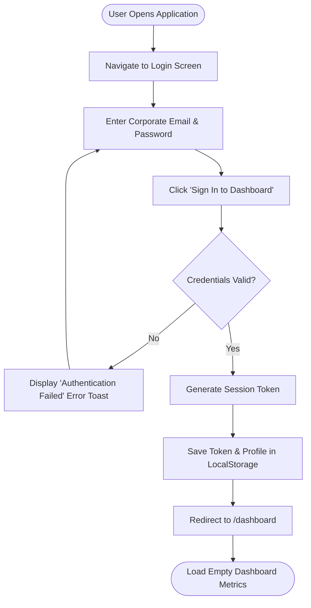
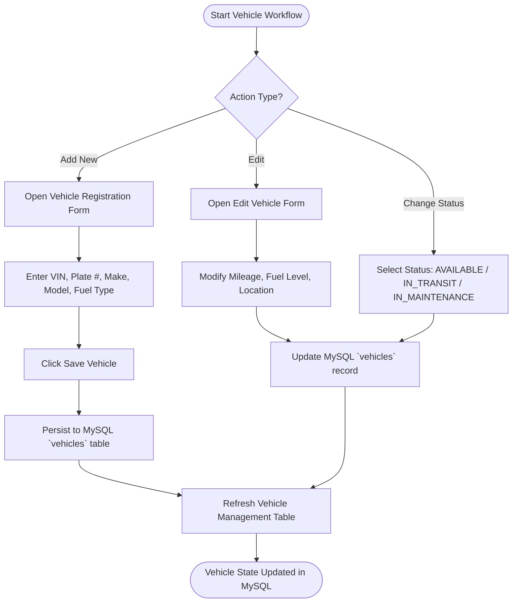
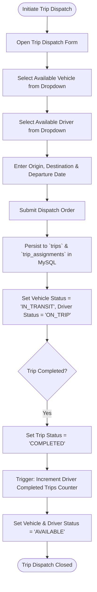
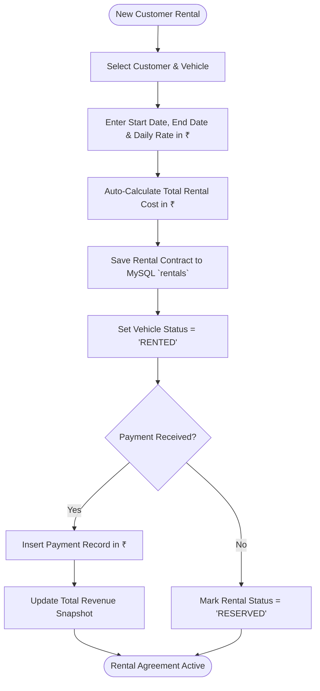
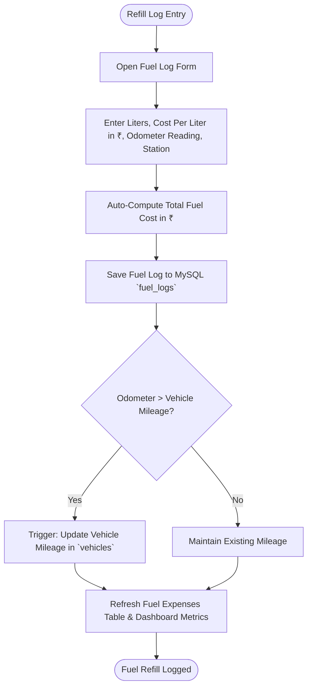
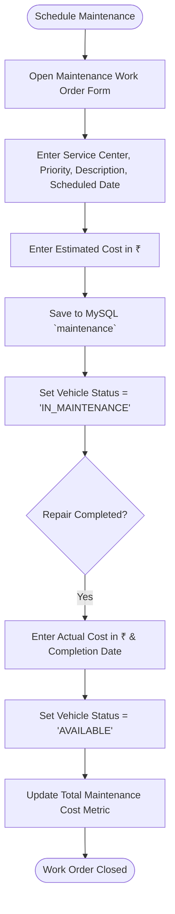

# Operational Flowcharts

This document details the business process flowcharts for key operational workflows in the **Fleet Manager** system.

---

## 1. User Login Process Flowchart

---

## 2. Vehicle Management Lifecycle Flowchart

---

## 3. Trip Dispatch Workflow Flowchart

---

## 4. Rental Contract Management Flowchart

---

## 5. Fuel Logging & Odometer Sync Flowchart

---

## 6. Maintenance Work Order Flowchart

