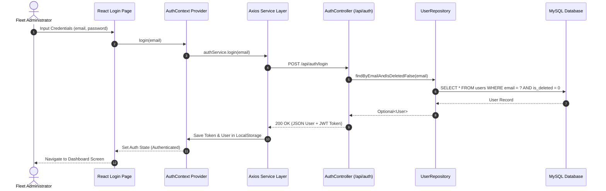
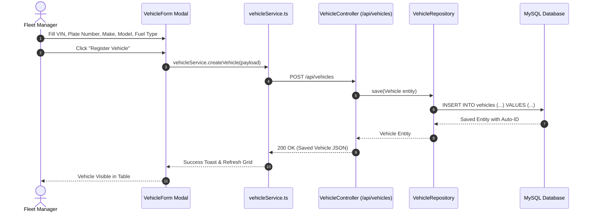
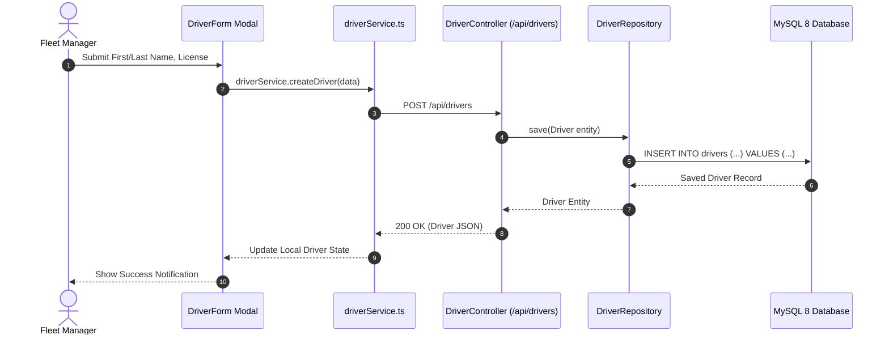
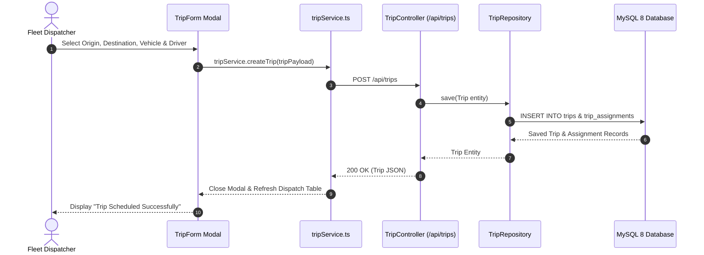
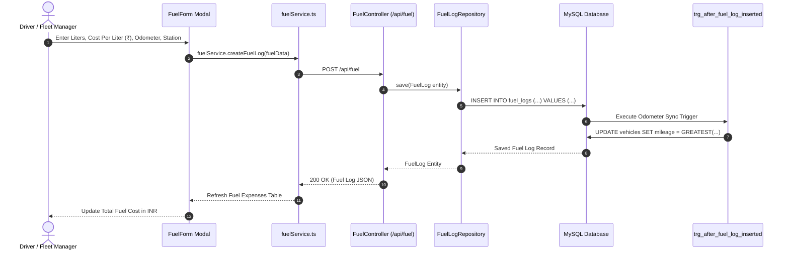
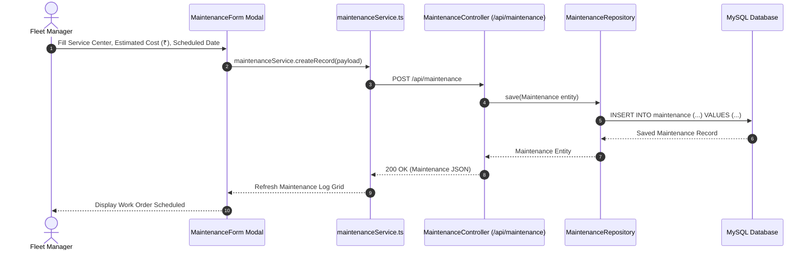
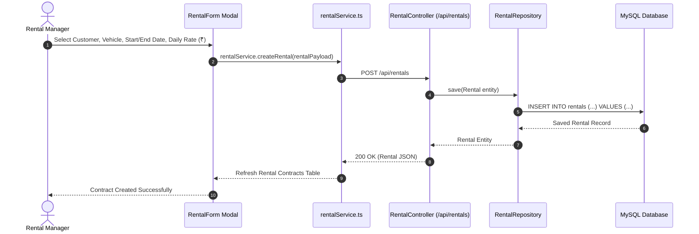
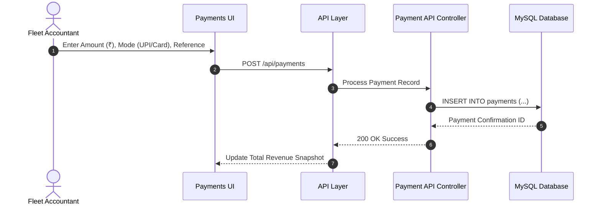
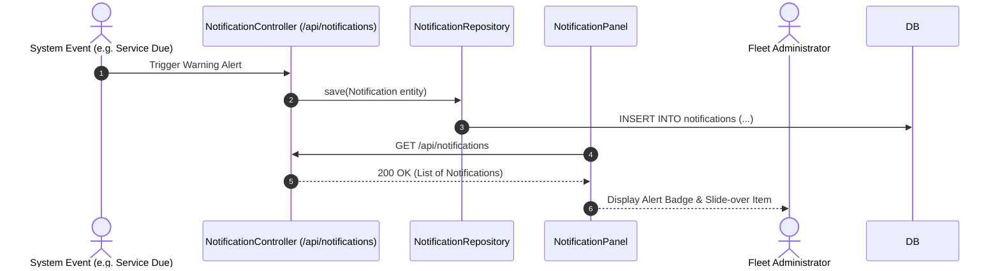

# System Sequence Diagrams

This document contains detailed end-to-end interaction sequence diagrams for key operational workflows in the **Fleet Manager** system.

---

## 1. User Authentication Sequence Diagram

---

## 2. Vehicle Registration Sequence Diagram

---

## 3. Driver Registration Sequence Diagram

---

## 4. Trip Assignment Sequence Diagram

---

## 5. Fuel Log Entry Sequence Diagram

---

## 6. Maintenance Work Order Sequence Diagram

---

## 7. Customer Rental Contract Sequence Diagram

---

## 8. Payment Flow Sequence Diagram

---

## 9. Notification Broadcast Sequence Diagram

