# UML Class Diagram Specification

This document presents the complete Object-Relational Model (ORM) UML Class Diagram for all domain entities in the **Fleet Manager** application.

---

## Complete Domain Entity Class Diagram

```mermaid
classDiagram
    class BaseEntity {
        <<Abstract>>
        +Long id
        +LocalDateTime createdAt
        +LocalDateTime updatedAt
        +String createdBy
        +String updatedBy
        +Boolean isDeleted
        #onCreate()
        #onUpdate()
    }

    class Role {
        +String name
        +String description
    }

    class Permission {
        +String name
        +String description
    }

    class RolePermission {
        +Role role
        +Permission permission
    }

    class User {
        +String username
        +String email
        +String passwordHash
        +String fullName
        +String phone
        +String department
        +String status
        +String avatarUrl
    }

    class UserRole {
        +User user
        +Role role
    }

    class VehicleType {
        +String code
        +String name
        +String description
    }

    class Vehicle {
        +String vin
        +String plateNumber
        +String make
        +String model
        +Integer year
        +VehicleType vehicleType
        +String fuelType
        +String status
        +Double mileage
        +Double fuelCapacity
        +Double currentFuelLevel
        +String location
    }

    class Driver {
        +User user
        +String firstName
        +String lastName
        +String email
        +String phone
        +String licenseNumber
        +String licenseCategory
        +LocalDate licenseExpiryDate
        +String status
        +Double safetyScore
        +Integer totalTripsCompleted
        +Vehicle assignedVehicle
        +LocalDate joinedDate
    }

    class Trip {
        +String tripCode
        +String origin
        +String destination
        +LocalDateTime scheduledDeparture
        +LocalDateTime scheduledArrival
        +LocalDateTime actualDeparture
        +LocalDateTime actualArrival
        +Double distanceKm
        +String status
        +String cargoDescription
        +String notes
    }

    class TripAssignment {
        +Trip trip
        +Vehicle vehicle
        +Driver driver
        +LocalDateTime assignedAt
        +String status
    }

    class Customer {
        +String name
        +String companyName
        +String email
        +String phone
        +String address
        +String gstTaxId
        +String status
        +Integer totalBookings
        +BigDecimal totalSpentInr
    }

    class Rental {
        +String rentalCode
        +Customer customer
        +Vehicle vehicle
        +LocalDate startDate
        +LocalDate endDate
        +BigDecimal dailyRateInr
        +BigDecimal totalCostInr
        +BigDecimal depositAmountInr
        +String status
        +String notes
    }

    class Payment {
        +String paymentNumber
        +Rental rental
        +Customer customer
        +BigDecimal amountInr
        +LocalDateTime paymentDate
        +String paymentMode
        +String transactionReference
        +String status
    }

    class FuelLog {
        +Vehicle vehicle
        +Driver driver
        +Double liters
        +BigDecimal costPerLiterInr
        +BigDecimal totalCostInr
        +Double odometerReading
        +String stationName
        +String fuelCardNumber
        +LocalDateTime filledAt
        +String notes
    }

    class Maintenance {
        +Vehicle vehicle
        +String type
        +String priority
        +String status
        +String description
        +String serviceCenter
        +String technicianName
        +BigDecimal estimatedCostInr
        +BigDecimal actualCostInr
        +LocalDate scheduledDate
        +LocalDate completionDate
        +Double odometerReading
        +String notes
    }

    class ServiceSchedule {
        +Vehicle vehicle
        +String serviceName
        +Double intervalKm
        +Integer intervalMonths
        +LocalDate lastServiceDate
        +Double lastServiceKm
        +LocalDate nextDueDate
        +Double nextDueKm
        +String status
    }

    class Expense {
        +String expenseNumber
        +String category
        +BigDecimal amountInr
        +Vehicle vehicle
        +Trip trip
        +Driver driver
        +LocalDate incurredDate
        +String vendorName
        +String receiptNumber
        +String status
        +String approvedBy
        +String notes
    }

    class Document {
        +String documentName
        +String documentType
        +String filePath
        +Long fileSizeBytes
        +String mimeType
        +String entityType
        +Long entityId
        +LocalDate expiryDate
    }

    class Notification {
        +String title
        +String message
        +String type
        +String category
        +LocalDateTime timestamp
        +Boolean isRead
        +String linkUrl
        +User recipientUser
    }

    class DashboardStatistic {
        +LocalDate statDate
        +Integer totalVehicles
        +Integer activeVehicles
        +Integer maintenanceVehicles
        +Integer totalDrivers
        +Integer activeDrivers
        +Integer ongoingTrips
        +Integer completedTripsMonth
        +BigDecimal totalFuelCostInr
        +BigDecimal totalMaintenanceCostInr
        +BigDecimal totalRevenueInr
        +Double fleetUtilizationRate
    }

    class ActivityLog {
        +User user
        +String username
        +String action
        +String entityName
        +Long entityId
        +String ipAddress
        +String userAgent
        +LocalDateTime timestamp
    }

    BaseEntity <|-- Role
    BaseEntity <|-- Permission
    BaseEntity <|-- RolePermission
    BaseEntity <|-- User
    BaseEntity <|-- UserRole
    BaseEntity <|-- VehicleType
    BaseEntity <|-- Vehicle
    BaseEntity <|-- Driver
    BaseEntity <|-- Trip
    BaseEntity <|-- TripAssignment
    BaseEntity <|-- Customer
    BaseEntity <|-- Rental
    BaseEntity <|-- Payment
    BaseEntity <|-- FuelLog
    BaseEntity <|-- Maintenance
    BaseEntity <|-- ServiceSchedule
    BaseEntity <|-- Expense
    BaseEntity <|-- Document
    BaseEntity <|-- Notification
    BaseEntity <|-- DashboardStatistic
    BaseEntity <|-- ActivityLog

    Role "1" -- "*" RolePermission : has
    Permission "1" -- "*" RolePermission : assigned_to
    User "1" -- "*" UserRole : holds
    Role "1" -- "*" UserRole : belongs_to
    VehicleType "1" -- "*" Vehicle : classifies
    User "1" -- "0..1" Driver : profile
    Vehicle "1" -- "0..1" Driver : drives
    Trip "1" -- "*" TripAssignment : involves
    Vehicle "1" -- "*" TripAssignment : assigned
    Driver "1" -- "*" TripAssignment : operates
    Customer "1" -- "*" Rental : contracts
    Vehicle "1" -- "*" Rental : leased
    Rental "1" -- "*" Payment : triggers
    Customer "1" -- "*" Payment : pays
    Vehicle "1" -- "*" FuelLog : refueled
    Driver "1" -- "*" FuelLog : logs
    Vehicle "1" -- "*" Maintenance : services
    Vehicle "1" -- "*" ServiceSchedule : schedules
    Vehicle "0..1" -- "*" Expense : linked
    Trip "0..1" -- "*" Expense : linked
    Driver "0..1" -- "*" Expense : linked
    User "0..1" -- "*" Notification : receives
    User "0..1" -- "*" ActivityLog : performs
```

